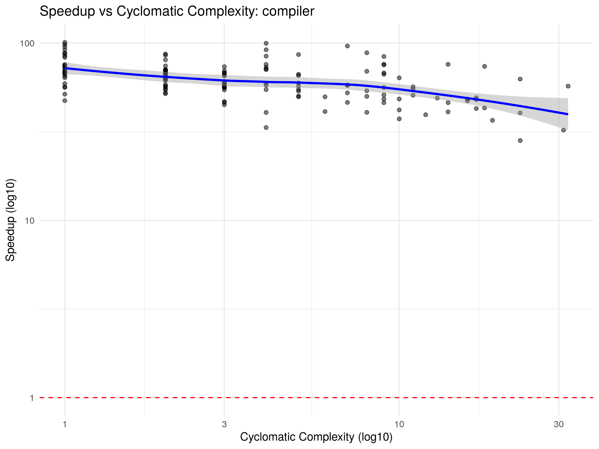
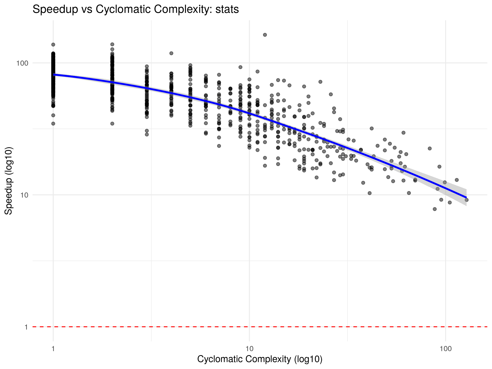
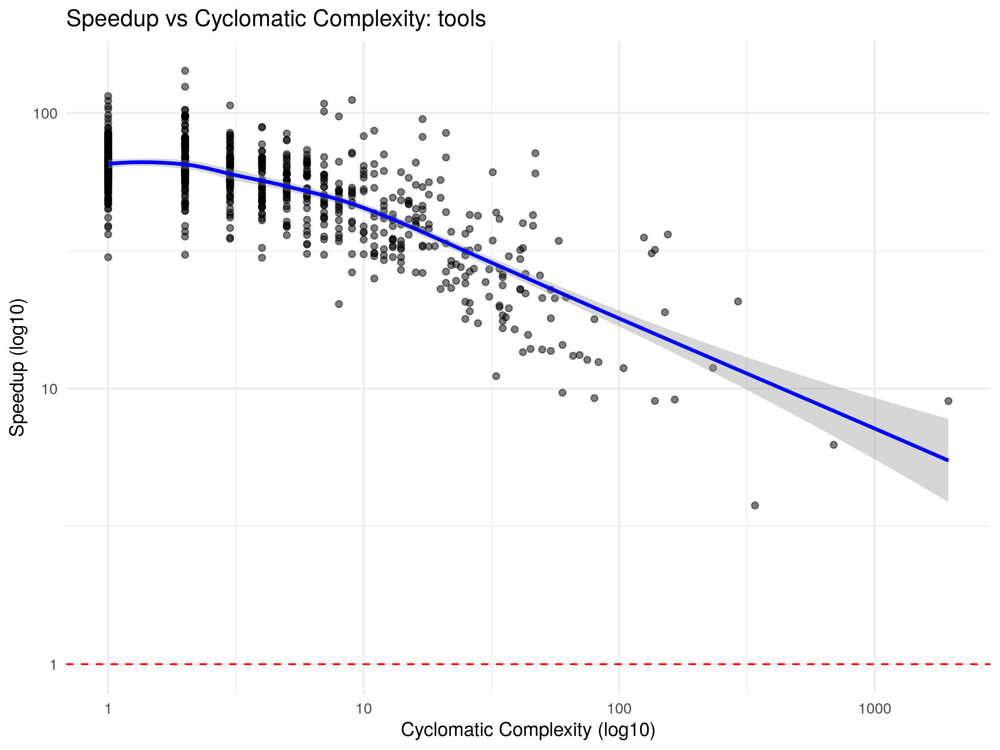
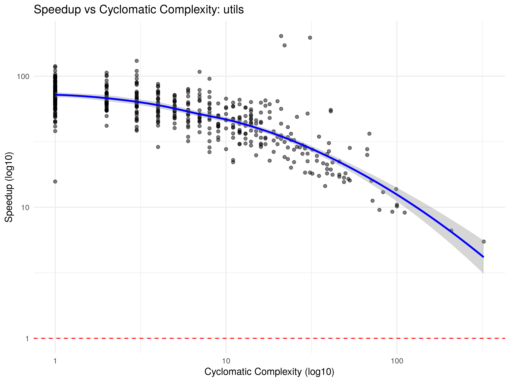

# Compiler Benchmark Report

## Package: `base`

### Core Metrics
- **Geometric Average Speedup:** 61.6469x

### Variation
- **Standard Deviation:** 20.2224
- **Variance:** 408.9447
- **Interquartile Range:** 27.0411

### Percentiles
| 1% | 5% | 25% | 50% (Median) | 75% | 95% | 99% |
|---|---|---|---|---|---|---|
| 17.02 | 31.47 | 52.49 | 65.58 | 79.53 | 98.51 | 108.12 |

### Absolute Throughput
- **Total GNU R Time:** 7.1605 seconds
- **Total crbcc Time:** 0.2634 seconds
- **Absolute Speedup:** 27.1807x

### Correlations
- **Lines of Code vs Speedup:** rho = -0.7226 (p = 2.75157e-186)
- **Cyclomatic Complexity vs Speedup:** rho = -0.6632 (p = 1.13941e-146)

### Visualization

---

## Package: `compiler`

### Core Metrics
- **Geometric Average Speedup:** 60.6198x

### Variation
- **Standard Deviation:** 14.9577
- **Variance:** 223.7325
- **Interquartile Range:** 19.0034

### Percentiles
| 1% | 5% | 25% | 50% (Median) | 75% | 95% | 99% |
|---|---|---|---|---|---|---|
| 32.70 | 40.61 | 51.65 | 61.51 | 70.66 | 88.51 | 99.14 |

### Absolute Throughput
- **Total GNU R Time:** 0.8209 seconds
- **Total crbcc Time:** 0.0162 seconds
- **Absolute Speedup:** 50.6380x

### Correlations
- **Lines of Code vs Speedup:** rho = -0.7211 (p = 1.37753e-23)
- **Cyclomatic Complexity vs Speedup:** rho = -0.4957 (p = 5.49656e-10)

### Visualization

---

## Package: `stats`

### Core Metrics
- **Geometric Average Speedup:** 55.6406x

### Variation
- **Standard Deviation:** 26.9786
- **Variance:** 727.8428
- **Interquartile Range:** 39.5348

### Percentiles
| 1% | 5% | 25% | 50% (Median) | 75% | 95% | 99% |
|---|---|---|---|---|---|---|
| 12.72 | 18.27 | 41.72 | 64.50 | 81.25 | 105.89 | 116.47 |

### Absolute Throughput
- **Total GNU R Time:** 12.7843 seconds
- **Total crbcc Time:** 0.5673 seconds
- **Absolute Speedup:** 22.5335x

### Correlations
- **Lines of Code vs Speedup:** rho = -0.8384 (p = 1.02282e-245)
- **Cyclomatic Complexity vs Speedup:** rho = -0.7896 (p = 3.34451e-198)

### Visualization

---

## Package: `tools`

### Core Metrics
- **Geometric Average Speedup:** 51.5533x

### Variation
- **Standard Deviation:** 19.4055
- **Variance:** 376.5747
- **Interquartile Range:** 23.6964

### Percentiles
| 1% | 5% | 25% | 50% (Median) | 75% | 95% | 99% |
|---|---|---|---|---|---|---|
| 11.72 | 21.31 | 43.52 | 57.71 | 67.22 | 84.22 | 103.70 |

### Absolute Throughput
- **Total GNU R Time:** 16.2299 seconds
- **Total crbcc Time:** 1.0942 seconds
- **Absolute Speedup:** 14.8326x

### Correlations
- **Lines of Code vs Speedup:** rho = -0.7567 (p = 3.88358e-146)
- **Cyclomatic Complexity vs Speedup:** rho = -0.6438 (p = 9.68625e-93)

### Visualization

---

## Package: `utils`

### Core Metrics
- **Geometric Average Speedup:** 52.2338x

### Variation
- **Standard Deviation:** 24.1611
- **Variance:** 583.7576
- **Interquartile Range:** 28.9671

### Percentiles
| 1% | 5% | 25% | 50% (Median) | 75% | 95% | 99% |
|---|---|---|---|---|---|---|
| 10.21 | 19.30 | 42.23 | 58.24 | 71.20 | 96.48 | 115.79 |

### Absolute Throughput
- **Total GNU R Time:** 7.0883 seconds
- **Total crbcc Time:** 0.3778 seconds
- **Absolute Speedup:** 18.7616x

### Correlations
- **Lines of Code vs Speedup:** rho = -0.8277 (p = 8.57625e-132)
- **Cyclomatic Complexity vs Speedup:** rho = -0.7354 (p = 1.95192e-89)

### Visualization

---

## Global Debugging Targets: Top 20 Worst Performers

| Package | Function | LOC | Cyclomatic Complexity | Speedup |
|---|---|---|---|---|
| tools | `.check_package_CRAN_incoming` | 803 | 340 | 3.7677x |
| utils | `install.packages` | 662 | 322 | 5.4683x |
| tools | `.install_packages` | 2084 | 691 | 6.2496x |
| utils | `str.default` | 561 | 208 | 6.6426x |
| stats | `plot.lm` | 347 | 88 | 7.7964x |
| base | `[<-.data.frame` | 283 | 174 | 8.3822x |
| stats | `predict.lm` | 226 | 105 | 8.7475x |
| tools | `.check_packages` | 6285 | 1944 | 9.0104x |
| tools | `.shlib_internal` | 376 | 138 | 9.0176x |
| utils | `read.DIF` | 248 | 111 | 9.1052x |
| tools | `httpd` | 524 | 165 | 9.1203x |
| stats | `arima` | 350 | 128 | 9.1465x |
| stats | `arima0` | 225 | 95 | 9.1782x |
| base | `loadNamespace` | 520 | 158 | 9.2033x |
| tools | `.check_package_depends` | 216 | 80 | 9.2346x |
| utils | `hsearch_db` | 244 | 94 | 9.2401x |
| utils | `read.table` | 208 | 79 | 9.5457x |
| tools | `codoc` | 309 | 60 | 9.6597x |
| utils | `RweaveLatexRuncode` | 303 | 100 | 10.1594x |
| stats | `nls` | 168 | 41 | 10.3011x |
