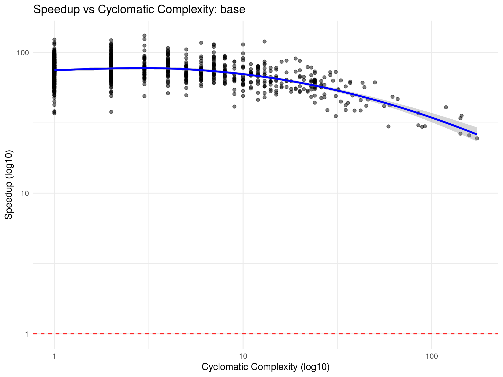
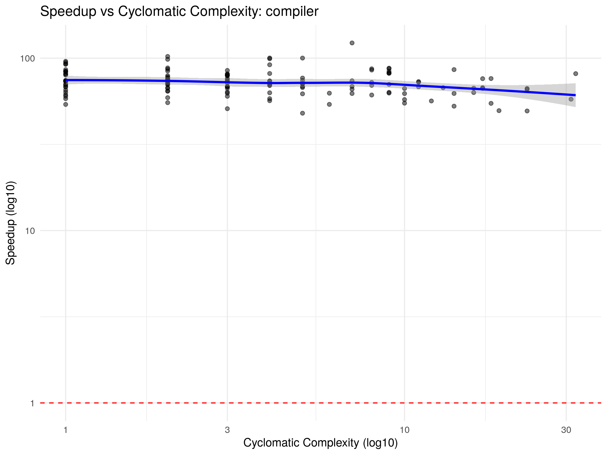
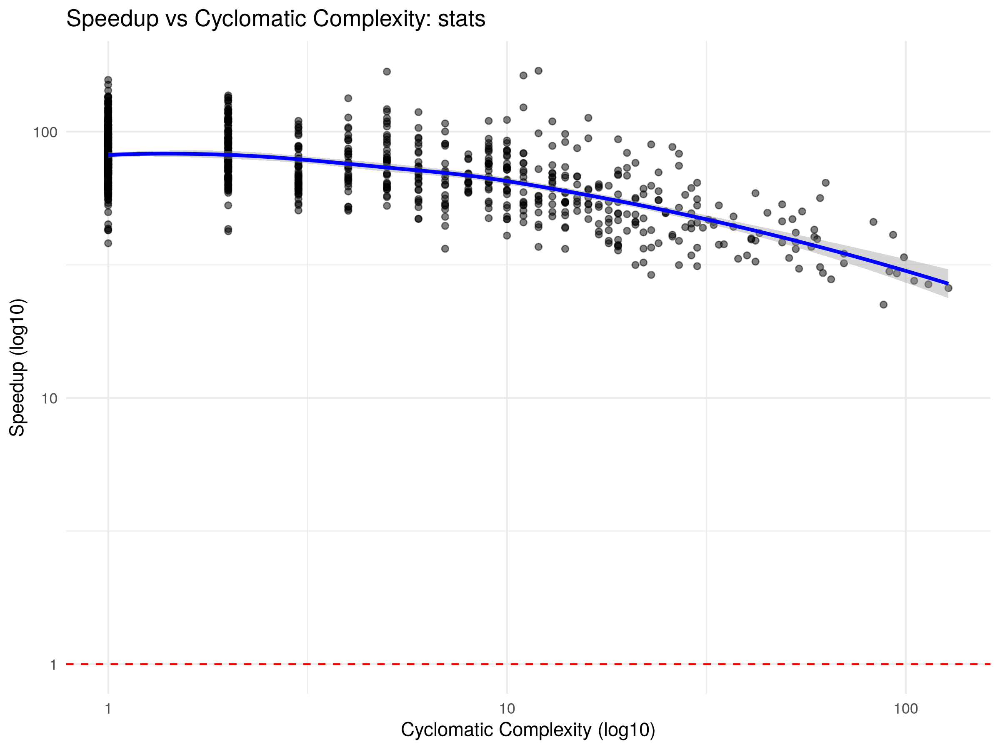
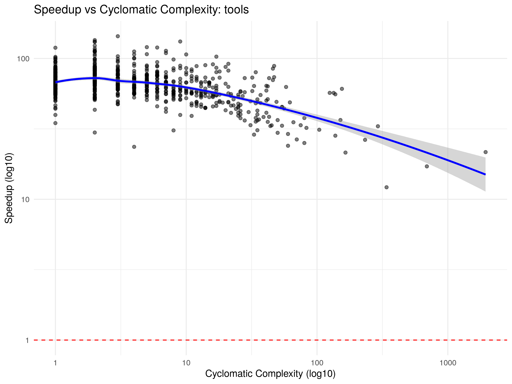
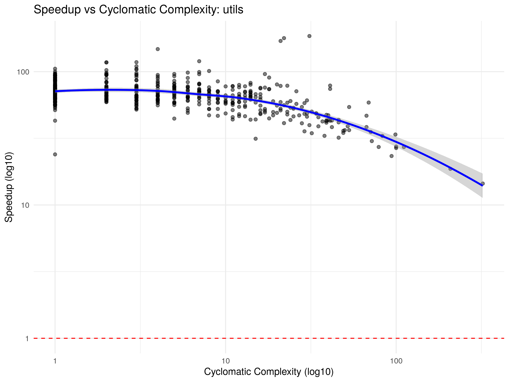

# Compiler Benchmark Report

## Package: `base`

### Core Metrics
- **Geometric Average Speedup:** 72.2621x

### Variation
- **Standard Deviation:** 14.7572
- **Variance:** 217.7757
- **Interquartile Range:** 19.2998

### Percentiles
| 1% | 5% | 25% | 50% (Median) | 75% | 95% | 99% |
|---|---|---|---|---|---|---|
| 37.35 | 51.71 | 63.73 | 73.25 | 83.03 | 97.43 | 113.76 |

### Absolute Throughput
- **Total GNU R Time:** 6.8779 seconds
- **Total crbcc Time:** 0.1340 seconds
- **Absolute Speedup:** 51.3117x

### Correlations
- **Lines of Code vs Speedup:** rho = -0.3400 (p = 1.61677e-32)
- **Cyclomatic Complexity vs Speedup:** rho = -0.2775 (p = 8.94096e-22)

### Visualization

---

## Package: `compiler`

### Core Metrics
- **Geometric Average Speedup:** 71.7323x

### Variation
- **Standard Deviation:** 12.0708
- **Variance:** 145.7043
- **Interquartile Range:** 14.8877

### Percentiles
| 1% | 5% | 25% | 50% (Median) | 75% | 95% | 99% |
|---|---|---|---|---|---|---|
| 49.48 | 54.61 | 64.90 | 72.34 | 79.78 | 94.51 | 101.50 |

### Absolute Throughput
- **Total GNU R Time:** 0.7694 seconds
- **Total crbcc Time:** 0.0115 seconds
- **Absolute Speedup:** 66.6812x

### Correlations
- **Lines of Code vs Speedup:** rho = -0.4740 (p = 3.77809e-09)
- **Cyclomatic Complexity vs Speedup:** rho = -0.2537 (p = 0.00258151)

### Visualization

---

## Package: `stats`

### Core Metrics
- **Geometric Average Speedup:** 71.4435x

### Variation
- **Standard Deviation:** 22.5749
- **Variance:** 509.6240
- **Interquartile Range:** 26.6227

### Percentiles
| 1% | 5% | 25% | 50% (Median) | 75% | 95% | 99% |
|---|---|---|---|---|---|---|
| 30.68 | 39.39 | 60.59 | 73.70 | 87.21 | 115.46 | 134.66 |

### Absolute Throughput
- **Total GNU R Time:** 13.3694 seconds
- **Total crbcc Time:** 0.2832 seconds
- **Absolute Speedup:** 47.2161x

### Correlations
- **Lines of Code vs Speedup:** rho = -0.5652 (p = 2.89993e-79)
- **Cyclomatic Complexity vs Speedup:** rho = -0.5344 (p = 1.59563e-69)

### Visualization

---

## Package: `tools`

### Core Metrics
- **Geometric Average Speedup:** 64.2672x

### Variation
- **Standard Deviation:** 16.8231
- **Variance:** 283.0166
- **Interquartile Range:** 17.3468

### Percentiles
| 1% | 5% | 25% | 50% (Median) | 75% | 95% | 99% |
|---|---|---|---|---|---|---|
| 26.56 | 39.23 | 57.08 | 65.75 | 74.43 | 94.63 | 119.23 |

### Absolute Throughput
- **Total GNU R Time:** 16.2850 seconds
- **Total crbcc Time:** 0.4885 seconds
- **Absolute Speedup:** 33.3352x

### Correlations
- **Lines of Code vs Speedup:** rho = -0.4790 (p = 4.27584e-46)
- **Cyclomatic Complexity vs Speedup:** rho = -0.3680 (p = 1.71585e-26)

### Visualization

---

## Package: `utils`

### Core Metrics
- **Geometric Average Speedup:** 65.2173x

### Variation
- **Standard Deviation:** 18.3388
- **Variance:** 336.3119
- **Interquartile Range:** 17.2779

### Percentiles
| 1% | 5% | 25% | 50% (Median) | 75% | 95% | 99% |
|---|---|---|---|---|---|---|
| 27.20 | 40.87 | 58.55 | 66.38 | 75.83 | 95.46 | 117.70 |

### Absolute Throughput
- **Total GNU R Time:** 6.8575 seconds
- **Total crbcc Time:** 0.1758 seconds
- **Absolute Speedup:** 39.0021x

### Correlations
- **Lines of Code vs Speedup:** rho = -0.5523 (p = 8.81452e-43)
- **Cyclomatic Complexity vs Speedup:** rho = -0.4539 (p = 9.64469e-28)

### Visualization

---

## Global Debugging Targets: Top 20 Worst Performers

| Package | Function | LOC | Cyclomatic Complexity | Speedup |
|---|---|---|---|---|
| tools | `.check_package_CRAN_incoming` | 803 | 340 | 12.1659x |
| utils | `install.packages` | 662 | 322 | 14.4733x |
| tools | `.install_packages` | 2084 | 691 | 17.1229x |
| utils | `str.default` | 561 | 208 | 18.6686x |
| tools | `httpd` | 524 | 165 | 21.4555x |
| tools | `.check_packages` | 6285 | 1944 | 21.6270x |
| stats | `plot.lm` | 347 | 88 | 22.4114x |
| utils | `hsearch_db` | 244 | 94 | 23.2852x |
| tools | `nonS3methods` | 57 | 4 | 23.5736x |
| utils | `.initialize.argdb` | 69 | 1 | 23.9540x |
| tools | `codoc` | 309 | 60 | 23.9832x |
| base | `[<-.data.frame` | 283 | 174 | 24.4959x |
| tools | `.check_package_depends` | 216 | 80 | 25.0962x |
| base | `loadNamespace` | 520 | 158 | 25.7425x |
| stats | `arima` | 350 | 128 | 25.8500x |
| tools | `.build_packages` | 1019 | 233 | 26.4276x |
| base | `rbind.data.frame` | 240 | 142 | 26.4445x |
| tools | `update_pkg_po` | 208 | 70 | 26.5923x |
| stats | `wilcox.test.default` | 358 | 114 | 26.7103x |
| utils | `RweaveLatexRuncode` | 303 | 100 | 26.7365x |
