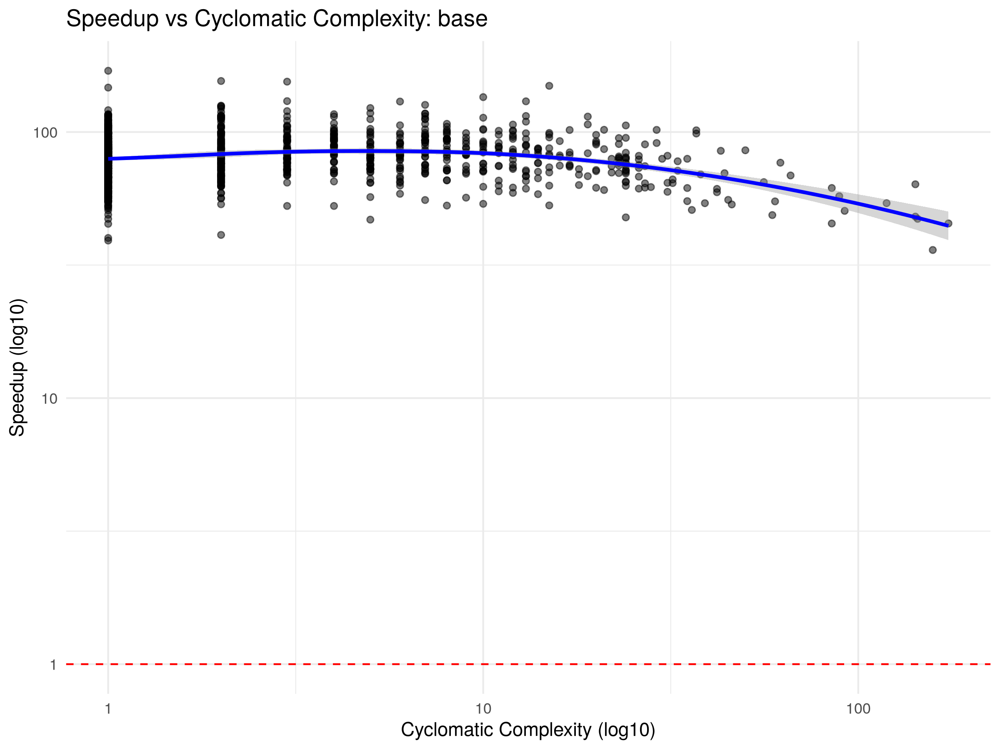
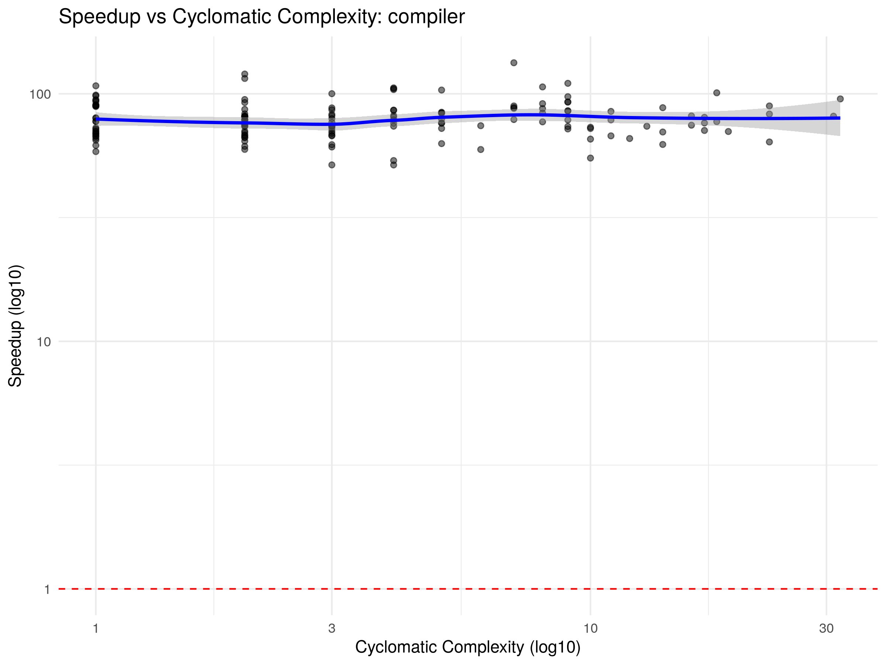
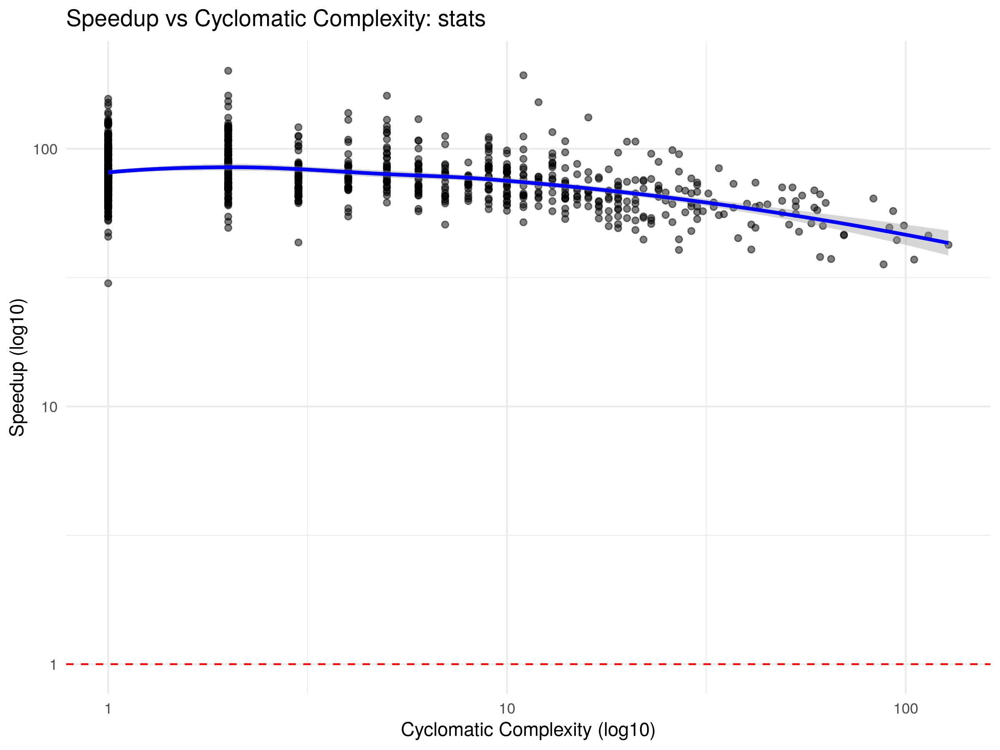

# Compiler Benchmark Report

## Package: `base`

### Core Metrics
- **Geometric Average Speedup:** 80.3798x

### Variation
- **Standard Deviation:** 16.0725
- **Variance:** 258.3244
- **Interquartile Range:** 20.2512

### Percentiles
| 1% | 5% | 25% | 50% (Median) | 75% | 95% | 99% |
|---|---|---|---|---|---|---|
| 48.41 | 57.34 | 71.28 | 81.38 | 91.54 | 109.14 | 124.85 |

### Absolute Throughput
- **Total GNU R Time:** 7.3893 seconds
- **Total crbcc Time:** 0.1083 seconds
- **Absolute Speedup:** 68.2012x

### Correlations
- **Lines of Code vs Speedup:** rho = -0.0454 (p = 0.123847)
- **Cyclomatic Complexity vs Speedup:** rho = 0.0012 (p = 0.968087)

### Visualization

---

## Package: `compiler`

### Core Metrics
- **Geometric Average Speedup:** 78.4870x

### Variation
- **Standard Deviation:** 13.7658
- **Variance:** 189.4966
- **Interquartile Range:** 16.7212

### Percentiles
| 1% | 5% | 25% | 50% (Median) | 75% | 95% | 99% |
|---|---|---|---|---|---|---|
| 52.41 | 60.84 | 70.50 | 78.40 | 87.22 | 105.01 | 118.31 |

### Absolute Throughput
- **Total GNU R Time:** 0.8022 seconds
- **Total crbcc Time:** 0.0106 seconds
- **Absolute Speedup:** 75.6064x

### Correlations
- **Lines of Code vs Speedup:** rho = -0.1546 (p = 0.0692064)
- **Cyclomatic Complexity vs Speedup:** rho = 0.0595 (p = 0.486295)

### Visualization

---

## Package: `stats`

### Core Metrics
- **Geometric Average Speedup:** 77.3850x

### Variation
- **Standard Deviation:** 19.8784
- **Variance:** 395.1490
- **Interquartile Range:** 21.2053

### Percentiles
| 1% | 5% | 25% | 50% (Median) | 75% | 95% | 99% |
|---|---|---|---|---|---|---|
| 44.27 | 53.88 | 66.97 | 76.39 | 88.18 | 115.91 | 144.01 |

### Absolute Throughput
- **Total GNU R Time:** 12.3272 seconds
- **Total crbcc Time:** 0.1993 seconds
- **Absolute Speedup:** 61.8606x

### Correlations
- **Lines of Code vs Speedup:** rho = -0.3663 (p = 8.80382e-31)
- **Cyclomatic Complexity vs Speedup:** rho = -0.3385 (p = 2.97158e-26)

### Visualization

---

## Package: `tools`

### Core Metrics
- **Geometric Average Speedup:** 69.5305x

### Variation
- **Standard Deviation:** 15.7928
- **Variance:** 249.4127
- **Interquartile Range:** 18.0765

### Percentiles
| 1% | 5% | 25% | 50% (Median) | 75% | 95% | 99% |
|---|---|---|---|---|---|---|
| 35.45 | 46.94 | 61.38 | 69.86 | 79.45 | 99.61 | 119.80 |

### Absolute Throughput
- **Total GNU R Time:** 15.9401 seconds
- **Total crbcc Time:** 0.3579 seconds
- **Absolute Speedup:** 44.5420x

### Correlations
- **Lines of Code vs Speedup:** rho = -0.2528 (p = 7.26515e-13)
- **Cyclomatic Complexity vs Speedup:** rho = -0.1541 (p = 1.49406e-05)

### Visualization

---

## Package: `utils`

### Core Metrics
- **Geometric Average Speedup:** 71.4123x

### Variation
- **Standard Deviation:** 17.4136
- **Variance:** 303.2322
- **Interquartile Range:** 18.0403

### Percentiles
| 1% | 5% | 25% | 50% (Median) | 75% | 95% | 99% |
|---|---|---|---|---|---|---|
| 39.24 | 50.06 | 63.03 | 71.23 | 81.07 | 101.73 | 118.26 |

### Absolute Throughput
- **Total GNU R Time:** 7.3066 seconds
- **Total crbcc Time:** 0.1330 seconds
- **Absolute Speedup:** 54.9194x

### Correlations
- **Lines of Code vs Speedup:** rho = -0.2489 (p = 9.08929e-09)
- **Cyclomatic Complexity vs Speedup:** rho = -0.1502 (p = 0.000598276)

### Visualization

---

## Global Debugging Targets: Top 20 Worst Performers

| Package | Function | LOC | Cyclomatic Complexity | Speedup |
|---|---|---|---|---|
| tools | `.check_package_CRAN_incoming` | 803 | 340 | 23.4205x |
| utils | `.initialize.argdb` | 69 | 1 | 24.6548x |
| utils | `install.packages` | 662 | 322 | 26.2671x |
| tools | `.install_packages` | 2084 | 691 | 27.0596x |
| tools | `.check_packages` | 6285 | 1944 | 28.8177x |
| stats | `NLSstAsymptotic` | 1 | 1 | 30.0664x |
| tools | `.build_packages` | 1019 | 233 | 31.7805x |
| utils | `format.roman` | 1 | 1 | 32.8039x |
| tools | `nonS3methods` | 57 | 4 | 33.4518x |
| tools | `httpd` | 524 | 165 | 34.0100x |
| utils | `warnErrList` | 20 | 4 | 34.0909x |
| tools | `.check_pragmas` | 64 | 8 | 34.1535x |
| utils | `str.default` | 561 | 208 | 34.5084x |
| tools | `.get_S3_primitive_generics` | 14 | 2 | 34.9377x |
| tools | `.massage_file_parse_error` | 6 | 2 | 35.5735x |
| stats | `plot.lm` | 347 | 88 | 35.5940x |
| base | `loadNamespace` | 520 | 158 | 36.0336x |
| stats | `predict.lm` | 226 | 105 | 37.1445x |
| stats | `glm.fit` | 230 | 65 | 37.3530x |
| tools | `.check_packages_used` | 303 | 104 | 37.6045x |
